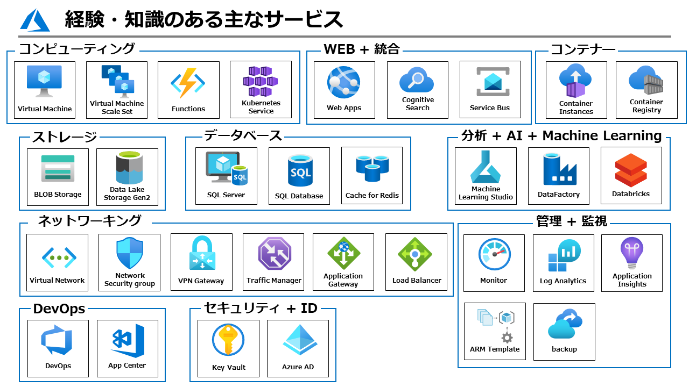

# 個人データ

| Key        | Value                                         |
|------------|-----------------------------------------------|
| Name       | Kentaro Higashi                               |
| Twitter    | https://twitter.com/roulgonzaress             |
| Qiita      | https://qiita.com/roulgonzaress               |
| SlideShare | https://www.slideshare.net/KentaroHigashi     |
| connpass   | https://connpass.com/user/KentaroHigashi/     |

# 概要
インフラエンジニアとして10年以上の実務経験があります。 直近の2年弱はMicrosoft Azureを利用したWebシステムの設計、構築を行っています。
それ以前はネットワークの経験が一番長く6年程の実務経験があり、設計～運用・保守までの経験があります。規模の大きなものだと災対センターの構築があります。
サーバも4年程経験があり、設計～構築までの経験があります。SES企業で働いてきており、今はフリーランスエンジニアです。

# LT枠参加
- [第三十八回 Azureもくもく会 @ 品川](https://azure-moku2.connpass.com/event/157123/)
- [DevRel/Community #6 〜ユーザカンファレンス〜](https://devrel.connpass.com/event/158094/)
- [第三十九回 Azureもくもく会 @ 品川](https://azure-moku2.connpass.com/event/159905/)
- [第四〇回 Azureもくもく会 @ 品川](https://azure-moku2.connpass.com/event/162655/)

# スキルセット

スキル、知識レベルを5点評価で自己採点しています。
| Microsoft Azure 　　　　   | Level                     |
|:--------------------------|--------------------------:|
| Traffic Manager           | :star::star::star::star:  |
| Application Gateway       | :star::star::star:        |
| Web Apps                  | :star::star::star::star:  |
| Virtual Network           | :star::star::star:        |
| Network Security Group    | :star::star::star:        |
| Azure SQL Database        | :star::star:              |
| Azure Monitor             | :star::star::star:        |
| Azure Virtural Machine    | :star::star::star:        |
| Storage Account           | :star::star::star:        |
| Azure Backup              | :star::star:              |
| Azure Active Directory    | :star::star::star:        |
| Azure Databricks          | :star::star:              |
| Azure DataFactory         | :star::star:              |
| Azure DevOps              | :star::star:              |
| Visual Studio App Center  | :star:                    |

| amazon web services       | Level                     |
|:--------------------------|--------------------------:|
| EC2                       | :star::star:              |
| ELB                       | :star:                    |
| VPC                       | :star::star:              |
| S3                        | :star:                    |
| Cloud Watch               | :star:                    |

| Security                  | Level                     |
|:--------------------------|--------------------------:|
| Imperva WAF               | :star::star:              |
| RSA (SEIM)                | :star:                    |
| Cisco ASA5500シリーズ      | :star::star::star:        |
| Fortigate XXXDシリーズ     | :star::star:              |

| Network                   | Level                     |
|:--------------------------|--------------------------:|
| Cisco 3900シリーズ | :star::star::star::star: |
| Cisco ISRシリーズ | :star::star::star::star: |
| Cisco 7200シリーズ | :star::star::star: |
| Cisco 3600シリーズ | :star::star::star: |
| NEC IX2000シリーズ | :star::star::star: |
| Catalyst 2960シリーズ | :star::star::star::star: |
| Catalyst 6500シリーズ | :star::star: |
| Catalyst 5500シリーズ | :star: |
| Alaxala Switch | :star: |
| Cisco TelePresence | :star: |
| Cisco UCSシリーズ | :star: |

| Routing / Switching       | Level                     |
|:--------------------------|--------------------------:|
| OSPF | :star::star::star: |
| EIGRP | :star::star::star: |
| BGP | :star: |
| Redistribution | :star::star::star: |
| RSTP | :star::star: |
| PVST+ | :star::star: |

| Storage                   | Level                     |
|:--------------------------|--------------------------:|
| IBM DS4300 | :star::star: |
| HP X1600 | :star::star: |

| Server                    | Level                     |
|:--------------------------|--------------------------:|
| IBM x346 | :star::star: |
| HP Proliantシリーズ | :star::star: |

| Virtualization            | Level                     |
|:--------------------------|--------------------------:|
| VMware ESXi               | :star::star::star:        |
| Docker                    | :star:                    |

| OS                        | Level                     |
|:-----------------------------|--------------------------:|
| Windows Server 2003          | :star::star:              |
| Windows Server 2008 / 2008R2 | :star::star:              |
| Windows Server 2012 / 2012R2 | :star::star::star:        |
| Windows Server 2016          | :star::star::star:        |
| Linux（RedHat）              | :star::star::star:         |
| Linux（CentOS）              | :star::star::star:         |
| Linux（Ubuntu）              | :star::star:               |
| Solaris                      | :star:                    |
| HP-UX                        | :star:                    |

| Middleware                | Level                     |
|:--------------------------|--------------------------:|
| Active Directory          | :star::star::star:        |
| Apache                    | :star::star::star:        |
| Bind                      | :star::star::star:        |
| Veritas ClusterServer     | :star::star::star::star:  |

| RDBMS                     | Level                     |
|:--------------------------|--------------------------:|
| Oracle10g / 11g           | :star::star::star:        |
| MySQL                     | :star::star:              |
| PostgreSQL                | :star::star:              |
| ElasticSearch             | :star:                    |

| Programming Language          | Level                     |
|:------------------------------|--------------------------:|
| C#Script                      | :star:                    |
| JavaScript                    | :star::star:              |
| HTML                          | :star::star:              |
| CSS                           | :star::star:              |
| PowerShell                    | :star::star:              |
| Azure Resource Manager (JSON) | :star::star::star:        |

| Version Control           | Level                     |
|:--------------------------|--------------------------:|
| Git                       | :star::star::star:        |
| Subversion                | :star:                    |

| Tools                     | Level                     |
|:--------------------------|--------------------------:|
| Visual Studio Code        | :star::star::star:        |
| Visual Studio             | :star::star:              |
| TeraTerm                  | :star::star::star::star:  |
| JMeter                    | :star::star::star:        |

# 保有資格
|資格|取得年月|
|:----|-------:|
| Azure DevOps Engineer Expert                    | 2019年11月 |
| Azure Administrator Associate                   | 2019年10月 |
| HTML5 レベル2                                   | 2019年4月 |
| Microsoft Azure Infrastructure Solutions の実装 | 2018年10月 |
| LPIC Level2                                     | 2017年10月 |
| VMware Sales Professional                       | 2013年5月 |
| CCNP                                            | 2013年4月 |
| モバイルシステム技術検定2級                       | 2012年6月 |
| マイクロソフトオフィススペシャリストPowerPoint2010 | 2012年6月 |
| マイクロソフトオフィススペシャリストWord2010       | 2012年5月 |
| マイクロソフトオフィススペシャリストExcel2010      | 2012年5月 |
| OracleMasterBronze 11g                          | 2013年4月 |

※更新の必要なものは失効していますが、参考として。CCNPに関してはCCNAのみ更新しています。

# 職歴

## 在庫最適化プロジェクト | 2020年5月 - 2020年11月

**インフラエンジニア / 外部設計～構築**

- ホストからクラウドへの移行提案
    - 非機能要求グレードの回答作成
    - 提案書作成
    - 超概算見積もり作成
- オンプレからAzureへWebシステムの移行
    - 方式設計書のレビュー、修正
    - 詳細設計書作成、レビュー、修正
    - ARM Template作成
    - owasp zap によるWAF機能テスト

## 在庫最適化プロジェクト | 2020年4月

**インフラエンジニア / 要件定義～構築**

- Azureのサービスを利用したデータ分析基盤構築の検証
    - Databricksのクラスタ作成
    - DataFactoryとDatabricksの連携（Databricksノートの呼び出し）
    - 作成した機械学習モデルをMachine Learningに登録、コンテナ―インスタンスにデプロイ
    - パラメータシート作成、マニュアル作成

## CMS on Azure プロジェクト | 2019年7月 - 2020年3月

**インフラエンジニア / 要件定義～構築**

- システム全体設計
    - RFPと提案構成の差分確認
    - 要件定義書作成、基本設計書作成、詳細設計書作成、試験仕様書作成
    - ARM Templateのカスタマイズによる環境構築

## BtoB WEB系システム更改支援（オンプレ⇒Azure | 2019年1月 - 2019年6月

**インフラエンジニア / 基本設計～詳細設計**

- 運用・監視設計
    - VMへのアプリのデプロイ方法の検討
    - 権限周りの設計
    - Azure Monitorを利用した監視設計
    - マイクロソフト社との技術定例（全体構成の相談など）

## 機械翻訳システムプロトタイプ構築支援 | 2018年10月 - 2018年12月

**インフラエンジニア / 基本設計～構築**

- システム全体設計、構築
    - Linux(Ubuntu) 仮想マシンの構築
    - Azure Monitorを用いた監視の設計、構築
    - 脆弱性診断テスト（OWSAP ZAP）
    - 社内メンバーへのレクチャー

## インフラ設計構築支援全般 | 2018年4月～2018年9月

**インフラエンジニア / 基本設計～構築**

- ActiveDirectory移行（Windows Server 2003中間 ⇒ Windows Server 2012R2）
    - 移行手順の検証など
- 仮想サーバの導入
    - サーバ設定（RAID、iLO）
    - VMwareESXi設定、VM構築
- Azureへの移行
    - AzCopy（BLOB→WindowsVMへのデータ移行）
    - Azure Backup を利用したVMのバックアップ

## セキュリティ関連事業 | 2016年12月～2018年3月

**インフラエンジニア / 基本設計～構築**

- 内部監査製品導入
    - 検証製品のリストアップ、テスト仕様書作成、テストの実施
- MSSサービスの導入
    - NVA(Router)構築、VMware-HA構築、ログサーバ構築
- WAF、SEIM製品の導入
    - IPアドレス、SSH等の初期設定、ユーザー登録などの初期セットアップ

## ネットワーク統合プロジェクト | 2016年7月～2016年11月

**インフラエンジニア / 基本設計～構築**

- 会社合併に伴うネットワーク統合設計、構築
    - 各回線の利用率の調査
    - NW構成図の作成
    - VPN設定

## ASP系でのサポート業務 | 2015年6月～2016年6月

**サポート担当 / 提案、サポート**

- 見積もり作成
- 社内問い合わせ対応

## 構成管理業務 | 2015年1月～2015年3月

**インフラエンジニア / 保守**

- NW機器、SV機器の資産棚卸
    - NW構成図の作成
    - IPアドレス管理表など各種管理表の更新

## プリセールス業務 | 2013年12月～2014年12月

**インフラエンジニア / 提案～構築**

- Active Directoryの導入
    - シングルフォレスト/シングルドメインの設定
    - グループポリシーの作成（ユーザーの構成）
- 営業同行
    - 提案書作成、説明

## ネットワーク運用業務 | 2013年4月～2013年9月

**インフラエンジニア / 運用**

- 某研究機関様にてインフラの運
    - L3スイッチ設定変更（ACL/スタティックルーティング/VRRP）
    - L2スイッチ設定変更（PVST）

## オフサイトセンター構築プロジェクト | 2012年7月～2013年3月

**インフラエンジニア / 基本設計～構築**

- ネットワーク全体設計、構築
    - 物理構成図作成
    - L3スイッチ設定（ACL/スタティックルーティング/HSRP/QoS）
    - L2スイッチ設定（Stack/VLAN）

## ネットワーク運用業務 | 2011年7月～2012年6月

**インフラエンジニア / 基本設計～構築**

- システム設計
    - 検証製品のリストアップ、テスト仕様書作成、テストの実施
    - NVA(Router)構築、VMware-HA構築、ログサーバ構築
    - IPアドレス、SSH等の初期設定、ユーザー登録などの初期セットアップ

## ネットワーク運用業務 | 2009年1月～2011年1月

**インフラエンジニア / 基本設計～運用**

- Active Directory導入
    - シングルフォレスト/シングルドメインの設定
    - 双方向信頼関係の設定
    - グループポリシーの作成（ユーザーの構成
- ネットワーク運用
    - ルータの設定変更（ACL/スタティックルーティング）
    - 試験仕様書の作成

## NGN関連プロジェクト | 2008年10月～2008年12月

**インフラエンジニア / 構築**

- DBサーバ構築
    - ハードウェアの設定（RAID/LUN）
    - Oracle10gR2のインストール、設定・テスト

## ネットワーク運用業務 | 2007年4月～2008年9月

**インフラエンジニア / 運用～保守**

- 某金融機関様のネットワーク運用
    - L3スイッチ設定変更（ACL/スタティックルーティング）
    - 障害対応（機器交換/報告書作成）

## 製品検証業務 | 2005年9月～2007年3月

**インフラエンジニア / 社内検証～社内サポート**

- Veritas製品導入前検証、サポート
    - Veritas StorageFoundation 機能検証（ボリューム作成/削除/拡大/縮小/スナップショット）
    - Veritas ClusterServer 機能検証（電源障害、ネットワーク障害、ソフトウェア障害想定時の挙動確認）
    - 製品バグのベンダーへのエスカレーション